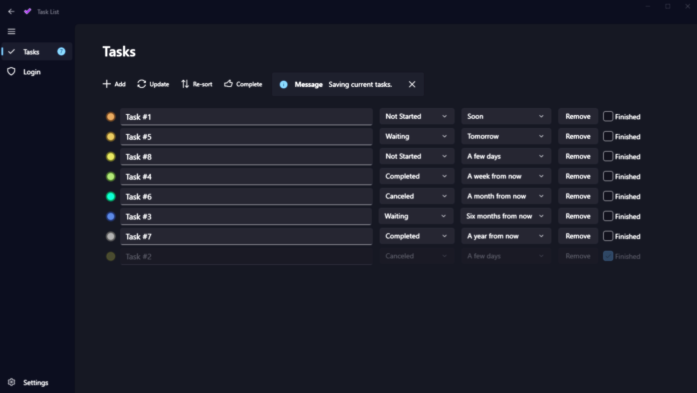

# 💻 WinUI3 - Task List App

### 📝 v1.0.0.1 - August 2023

* I have reworked this entire project, which was originally from [Pdawg-bytes](https://github.com/Pdawg-bytes/WinUI3-TaskList)
* It is now fully functional and bug-free. I have left **TODO** markers for a developer's future enhancements.
* I have removed the code related to [WinUIEx](https://github.com/dotMorten/WinUIEx) as it was causing conflicts/exceptions and preventing the update of the existing SDKs.
    - Where relevant, I added code to handle the resizing, icon update and centering of the *MainWindow*.
* This project uses the following additional packages:
    - [CommunityToolkit.WinUI](https://github.com/CommunityToolkit/WindowsCommunityToolkit)
    - [CommunityToolkit.Common](https://learn.microsoft.com/en-us/dotnet/api/communitytoolkit.common?view=win-comm-toolkit-dotnet-7.0&viewFallbackFrom=win-comm-toolkit-dotnet-6.1)
    - [CommunityToolkit.Mvvm](https://learn.microsoft.com/en-us/dotnet/communitytoolkit/mvvm/)
    - [Microsoft.Extensions.Hosting](https://www.nuget.org/packages/Microsoft.Extensions.Hosting)
    - [Microsoft.Xaml.Behaviors.WinUI.Managed](https://www.nuget.org/packages/Microsoft.Xaml.Behaviors.WinUI.Managed)

## 🚀 Future Enhancments
* Application activation via **Toast Notifications** still needs work.
  - This can be handled through `Task_List_App.Services.ActivationService.HandleActivationAsync`.
  - I have added the logic, but a [Mutex](https://learn.microsoft.com/en-us/dotnet/api/system.threading.mutex?view=net-6.0) will need to be created and managed.
* Finish language conversions and link additional `x:Uid` tags.

## 🎛️ Usage
* You can run this as a normal desktop app. Tooltps are provided for each action.
* If the database is absent, a new one will be created.
* `Alt-A`/`Ctrl-A` Adds a new task.
* `Alt-S`/`Ctrl-S` Saves any changes.
* `Alt-X`/`Ctrl-X` Exit the application.
* If the task's title contains a URL then it will be opened in a browser when that task is selected in the list.
* After adding the **Complete** `AppBarButton` (which was ment to mark multiple tasks when ready), I found it was easier to use the `CheckBox`. I have left this `AppBarButton` for posterity.

## 🧾 License/Warranty
* This carries the original License from [Pdawg-bytes](https://github.com/Pdawg-bytes/WinUI3-TaskList), but in the event that said license is absent:
* Permission is hereby granted, free of charge, to any person obtaining a copy of this software and associated documentation files (the "Software"), to deal in the Software without restriction, including without limitation the rights to use, copy, modify, merge, publish and distribute copies of the Software, and to permit persons to whom the Software is furnished to do so, subject to the following conditions: The above copyright notice and this permission notice shall be included in all copies or substantial portions of the Software.
* The software is provided "as is", without warranty of any kind, express or implied, including but not limited to the warranties of merchantability, fitness for a particular purpose and noninfringement. In no event shall the author or copyright holder be liable for any claim, damages or other liability, whether in an action of contract, tort or otherwise, arising from, out of or in connection with the software or the use or other dealings in the software.
* Copyright © 2022–2023. All rights reserved.

## 📋 Proofing
* This application was compiled and tested using *VisualStudio* 2022 on *Windows 10* versions **22H2**, **21H2** and **21H1**.
